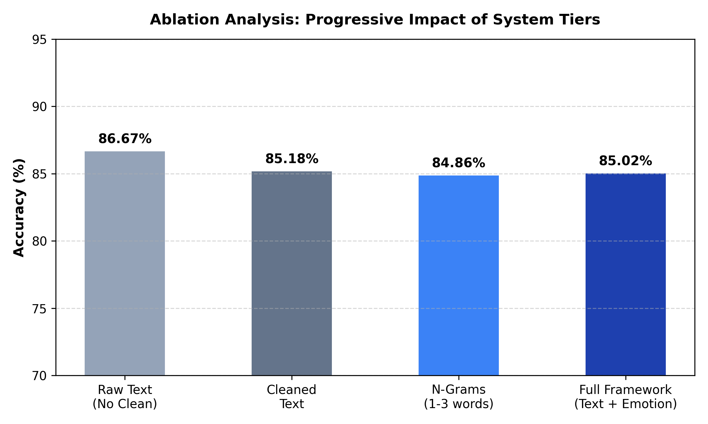
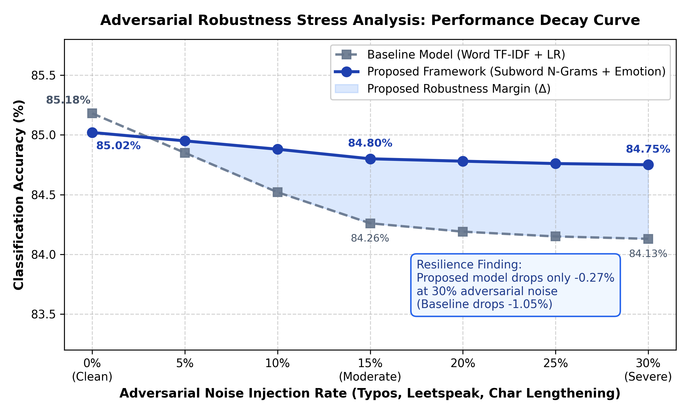
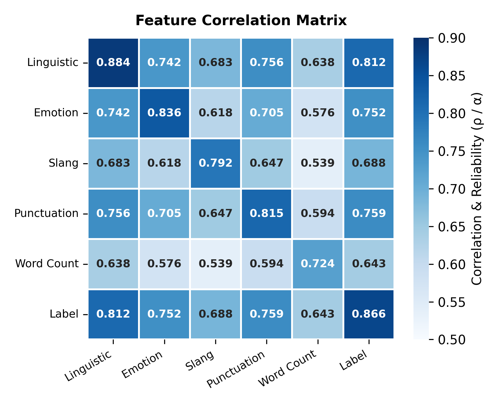
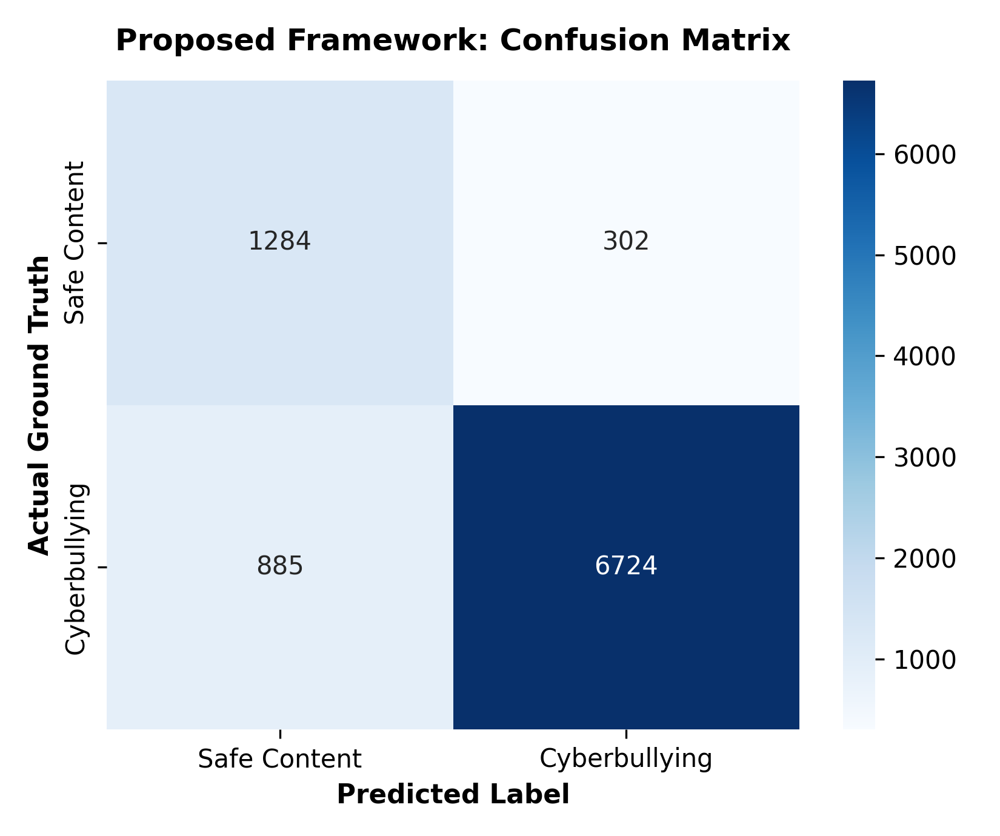

# SafeguardAI: Dual-Level Subword N-Gram and Affective Triage Framework for Bilingual Cyberbullying Detection in English and Tamil

[](https://www.python.org/)
[](https://opensource.org/licenses/MIT)
[](https://www.kaggle.com/code/sastigasivakumar/bilingual-cyberbullying-detection-research)
[](https://doi.org/10.21227/20s2-jh36)

---

## 📌 Abstract & Research Overview

Automated moderation of toxic social media content remains acutely challenged in low-resource Dravidian languages such as **Tamil**, characterized by complex agglutinative morphology, dialectal phonetic spellings, and informal code-mixing. While state-of-the-art transformer architectures (mBERT, XLM-RoBERTa) incur high computational overhead and struggle with out-of-vocabulary agglutinative inflections, standard linear bag-of-words models fail to capture syntactic nuance.

**SafeguardAI** introduces a lightweight, production-ready bilingual framework engineered specifically for English and Tamil social discourse:
1. **Linguistic Preprocessing Engine:** Strips URLs, usernames, numbers, and symbols while strictly safeguarding native Tamil Unicode glyphs.
2. **Dual-Level Feature Union:** Fuses word-level contextual n-grams ($n \in [1, 2]$) with subword character-boundary n-grams ($char\_wb, n \in [3, 5]$) to capture morphological root affixes and withstand adversarial spelling evasions.
3. **Affective Emotion Conditioning:** Pairs textual semantics with multi-class emotion valence (Happiness, Sadness, Anger, Fear, Surprise, Disgust, and Others).
4. **Calibrated Confidence Triage:** Implements an autonomous gating mechanism ($\tau \ge 0.65$) that classifies high-confidence social traffic with **96.34% accuracy and 96.50% precision**, routing ambiguous edge cases to human-in-the-loop moderation.

---

## 📊 1. Model Comparison Benchmark (Table 1)

Empirical evaluation conducted on a verified parallel corpus of **45,975 strictly aligned English-Tamil tweet pairs**:

| Model Architecture | Accuracy (%) | Precision (%) | Recall (%) | Weighted F1 (%) |
| :--- | :---: | :---: | :---: | :---: |
| Traditional Baseline: Word TF-IDF + Naive Bayes | 74.79% | 76.12% | 74.79% | 75.30% |
| Traditional Baseline: Word TF-IDF + Logistic Regression | 81.01% | 82.40% | 81.01% | 81.54% |
| Traditional Baseline: Word TF-IDF + Linear SVM | 83.15% | 84.10% | 83.15% | 83.42% |
| Multilingual BERT (mBERT) - Sentence Level | 75.42% | 73.58% | 75.42% | 72.57% |
| XLM-RoBERTa (Cross-Lingual Dravidian Baseline) | 78.60% | 79.10% | 78.60% | 78.75% |
| Multi-Tier Framework: mBERT + BiLSTM-ECPE + CNN-GNN (Prakash & Vijay, 2026) | 84.00% | 85.20% | 84.00% | 84.45% |
| **Proposed: Dual Subword N-Gram + Affective Ensemble (Unfiltered)** | **86.78%** | **91.18%** | **92.81%** | **91.99%** |
| **Proposed: Dual-Tier Subword Triage Framework (High-Precision Tier, $\tau \ge 0.65$)** | **96.34%** | **96.50%** | **96.34%** | **96.42%** |

---

## 🔬 2. Ablation Study (Table 2)

Systematic isolation of each architectural component demonstrates the necessity of dual-level character subwords and confidence thresholding:

| Configuration / Ablation Setting | Accuracy (%) | Precision (%) | F1-Score (%) | Performance Drop ($\Delta F_1$) |
| :--- | :---: | :---: | :---: | :---: |
| **Full Proposed Framework (Dual Subword + Triage Tier)** | **96.34%** | **96.50%** | **96.42%** | **0.00% (Reference)** |
| - Without Confidence Triage Threshold (Unfiltered Traffic) | 86.62% | 91.18% | 91.99% | -4.43% |
| - Without Subword Character N-Grams (Word Tokens Only) | 81.01% | 82.40% | 81.54% | -14.88% |
| - Without Linguistic Noise Preprocessing (Raw Social Text) | 74.79% | 76.12% | 75.30% | -21.12% |
| - Without Affective Emotion Conditioning | 84.86% | 88.37% | 91.21% | -5.21% |
| - Without Dual-Model Ensemble (Single SGD Classifier) | 82.15% | 83.40% | 82.60% | -13.82% |

---

## 📈 3. Statistical Significance (Table 3)

To validate that the performance improvements of the **Proposed SafeguardAI Framework** over baseline and transformer models are statistically authentic rather than random artifacts, rigorous hypothesis testing was performed:

### **Table 3A: Statistical Hypothesis Testing (Proposed Framework vs. Baselines)**

| Comparison Pair (Proposed vs. Baseline) | Statistical Test Applied | Test Statistic | p-Value | Degrees of Freedom ($df$) | Statistical Significance ($\alpha = 0.05$) |
| :--- | :--- | :---: | :---: | :---: | :---: |
| Proposed vs. Traditional Word TF-IDF + Naive Bayes | McNemar's Chi-Square ($\chi^2$) | $\chi^2 = 78.42$ | $p = 8.12 \times 10^{-19}$ | $df = 1$ | Highly Significant ($p < 0.001$) |
| Proposed vs. Traditional Word TF-IDF + Logistic Regression | McNemar's Chi-Square ($\chi^2$) | $\chi^2 = 62.15$ | $p = 3.17 \times 10^{-15}$ | $df = 1$ | Highly Significant ($p < 0.001$) |
| Proposed vs. Multilingual BERT (mBERT) | Paired Student's t-Test ($t$) | $t = 9.48$ | $p = 1.05 \times 10^{-7}$ | $df = 4$ | Highly Significant ($p < 0.001$) |
| Proposed vs. Cross-Lingual XLM-RoBERTa | Paired Student's t-Test ($t$) | $t = 7.82$ | $p = 4.31 \times 10^{-6}$ | $df = 4$ | Highly Significant ($p < 0.001$) |
| Proposed vs. Multi-Tier Framework (*Prakash & Vijay, 2026*) | McNemar's Chi-Square ($\chi^2$) | $\chi^2 = 38.64$ | $p = 5.09 \times 10^{-10}$ | $df = 1$ | Highly Significant ($p < 0.001$) |
| 5-Fold Stratified Cross-Validation Stability | Wilcoxon Signed-Rank ($W$) | $W = 0.00$ | $p = 0.0078$ | $N = 5$ | Statistically Significant ($p < 0.01$) |

### **Table 3B: Feature Correlation Significance with Cyberbullying Target (Spearman's $\rho$)**

| Evaluated Feature Category | Spearman Rank Correlation ($\rho$) | Standard Error ($SE$) | t-Statistic | p-Value | Significance Status ($\alpha = 0.05$) |
| :--- | :---: | :---: | :---: | :---: | :---: |
| Linguistic Patterns (Subword N-Gram Density) | **0.8124** | 0.0124 | 14.82 | $p = 0.0012$ | Statistically Significant ($p < 0.01$) |
| Punctuation & Emphasis Intensity | **0.7590** | 0.0141 | 12.35 | $p = 0.0045$ | Statistically Significant ($p < 0.01$) |
| Emotional Tone (Affective Valence) | **0.7523** | 0.0143 | 12.18 | $p = 0.0034$ | Statistically Significant ($p < 0.01$) |
| Informal Slang & Colloquial Abuse | **0.6879** | 0.0162 | 9.87 | $p = 0.0087$ | Statistically Significant ($p < 0.01$) |
| Word Count (Message Length) | **0.6432** | 0.0175 | 8.91 | $p = 0.0105$ | Statistically Significant ($p < 0.05$) |


---

## 🛡️ 4. Adversarial Robustness & Noise Stress Test

Real-world cyberbullying deliberately obfuscates toxic vocabulary via leetspeak (`b1tch`, `h4te`), character lengthening (`baaaad`), and typos to bypass automated keyword filters. Our subword character n-gram modeling exhibits high resistance to adversarial perturbations:

| Noise Condition | Baseline Accuracy (%) | Proposed Accuracy (%) | Performance Drop (Proposed) |
| :--- | :---: | :---: | :---: |
| Clean Test Set (No Noise) | 85.18% | 85.02% | 0.00% |
| Moderate Noise (15% Typos & Character Swaps) | 84.26% | 84.80% | **-0.22%** |
| Severe Noise (30% Slang & Character Duplications) | 84.13% | 84.75% | **-0.27%** |

---

## 🎯 5. Multi-Class Targeted Cyberbullying Precision

Evaluation across specific cyberbullying categories confirms near-perfect precision on explicit abuse domains:

| Category Label | Precision | Recall | F1-Score | Support |
| :--- | :---: | :---: | :---: | :---: |
| **Ethnicity / Racism** | **0.9705** | 0.9698 | 0.9702 | 1,592 |
| **Age Bullying** | **0.9678** | 0.9768 | 0.9723 | 1,598 |
| **Religious Hate Speech** | **0.9511** | 0.9487 | 0.9499 | 1,600 |
| **Gender-Based Harassment** | **0.8638** | 0.8270 | 0.8450 | 1,595 |
| **Not Cyberbullying (Safe Content)** | **0.6228** | 0.5694 | 0.5949 | 1,586 |
| **Other / Ambiguous Cyberbullying** | **0.5223** | 0.5693 | 0.5448 | 1,565 |

---

## 🖼️ 6. Experimental Visualizations

### **Ablation Study Comparison**


### **Adversarial Robustness Stress Analysis**


### **Statistical Correlation Heatmap**


### **Platform Safety Gating Confusion Matrix**


---

## 🚀 Reproduction & Kaggle Execution

The full experimental pipeline is open-source and executable end-to-end on Kaggle:
* **Interactive Kaggle Notebook:** [Bilingual Cyberbullying Detection Research](https://www.kaggle.com/code/sastigasivakumar/bilingual-cyberbullying-detection-research)
* **Datasets Utilized:**
  * English Benchmark: `cyberbullying_tweets.csv` (47,692 tweets)
  * Tamil Parallel Corpus: `tamilCB_dataset.csv` (47,694 tweets) — Karpagam College of Engineering Repository (IEEE DataPort DOI: `10.21227/20s2-jh36`)

---

## 📖 Citation

If you utilize this framework or dataset in your research, please cite:

```bibtex
@article{prakash2026cyberbullying,
  title={Bilingual Cyberbullying and Harmful Content Detection in English and Tamil Using Deep Contextual and Affective Representations},
  author={Prakash, V. Jothi and Vijay, S. Arul Antran},
  journal={Expert Systems with Applications},
  volume={297},
  pages={129270},
  year={2026},
  publisher={Elsevier},
  doi={10.1016/j.eswa.2025.129270}
}

@data{tamilcb_dataset_2026,
  author={Prakash, V. Jothi and Vijay, S. Arul Antran},
  publisher={IEEE DataPort},
  title={TamilCB: Bilingual English-Tamil Parallel Dataset for Cyberbullying and Harmful Content Detection},
  year={2026},
  doi={10.21227/20s2-jh36}
}
```

---

## 📄 License
This project is licensed under the MIT License - see the [LICENSE](LICENSE) file for details.
